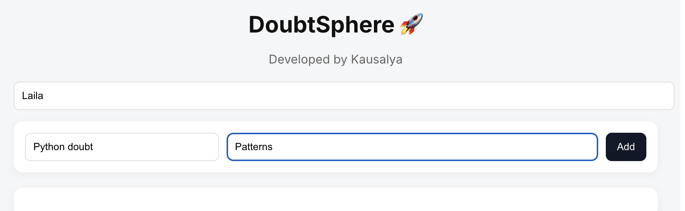
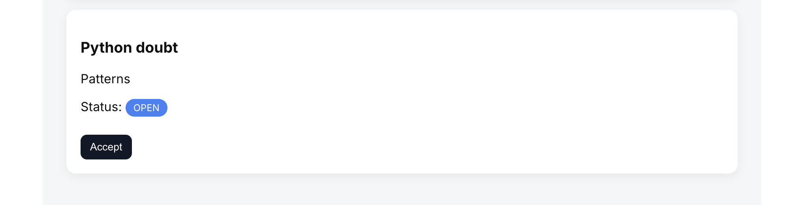

# DoubtSphere 🚀

A full-stack real-time doubt resolution platform with a first-accept locking system.

## Features

- Create and view doubts  
- First-accept system (only one guide can accept)  
- Status flow: OPEN → MATCHED  
- Real-time private chat between user and guide  
- Responsive UI using React
  
## 🧠 How It Works

- Users create doubts which are stored in the database  
- Doubts are marked as **OPEN** and visible to all guides  
- When a guide accepts a doubt, a locking mechanism ensures only one guide is assigned  
- The doubt status updates to **MATCHED**  
- A real-time chat (via Socket.IO) is established between the user and the guide  
- Communication continues until the doubt is resolved  

## 📁 Project Structure

/client → React frontend  
/server → Backend APIs  
/screenshots → UI images 

## 👩‍💻 Developed By

-Mallika Koppuravuri
-Kausalya Hariharan
-Anuhya

## 🚀 My Contributions

- Contributed to building the full-stack doubt resolution platform  
- Implemented the first-accept locking system  
- Worked on MongoDB integration with backend APIs  
- Designed parts of the responsive UI using React  

## 📸 Screenshots

### Home UI

### Add Doubt

### Accept Flow

### Private Chat

## 🎥 Demo Video

[▶ Watch Demo](https://drive.google.com/file/d/1PgDv9Oz2yKwh49RxeBBeTeSXZENmJ4MH/view?usp=sharing)

## 🛠 Tech Stack

Frontend:
- React.js
- CSS / Tailwind

Backend:
- Node.js
- Express.js

Database:
- MongoDB

Other:
- Socket.IO (for real-time chat)

## ⚙️ Installation

1. Clone the repository:
git clone https://github.com/CSI-VITAP-Skill-Builders/syntax-surgeons.git

2. Navigate to project folder:
cd doubtsphere

3. Install dependencies:
npm install

4. Start the server:
npm start

## 🔑 Environment Variables

Create a .env file and add:

MONGO_URI=your_mongodb_connection_string
PORT=5000

